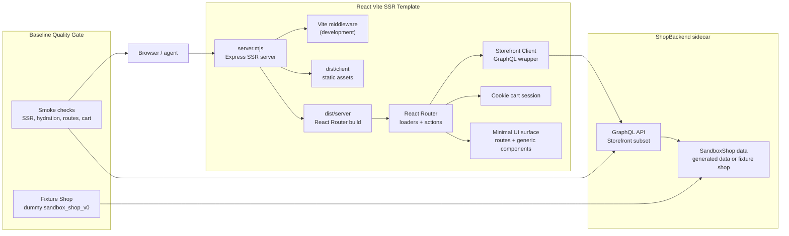

# React Vite SSR Template (`packages/shop_arena/src/shop_arena/gen/templates/react-vite`)

Status: **Spec (draft)** · Version: **0.1**
Owners: ShopArena

> A verified, minimal React + Vite + React Router SSR storefront
> template that talks directly to `shop_backend`, ships with a tiny
> dummy SandboxShop fixture, mirrors Hydrogen's serving model, and can
> later become a lower-dependency seed template for the `shop_gen` build
> loop.

---

## 1. Overview

`shop_arena.gen` currently builds generated storefronts from a vendored
Hydrogen template. Hydrogen gives generated shops a useful operating
shape: React Router route loaders and actions, server-rendered document
requests, client hydration, a development server with Vite middleware,
and a production server that serves `dist/client` assets while delegating
document requests to `dist/server`.

That shape is worth keeping. The Hydrogen-specific dependency surface is
less important for ShopGym's sandbox goal: generated shops only need to
talk to the local `shop_backend` GraphQL API, render plausible storefront
pages, and expose enough cart and navigation behavior for agents and
evaluators.

This spec defines a parallel `react-vite` template. It is a standalone
React + Vite + React Router SSR app with a small custom GraphQL client
for `shop_backend`. It does not replace Hydrogen in v0.1. Hydrogen remains
the default generated storefront until a later `shop_gen` integration
adds template selection.

Two failure modes motivate the shape of this template:

- **Template bugs compound.** If the seed template has broken routing,
  stale queries, fragile cart actions, or SSR/hydration issues,
  generated shops repeatedly inherit those bugs. The build loop then
  wastes early iterations fixing baseline defects instead of adapting the
  shop to the manual.
- **Over-designed templates collapse diversity.** If the template ships a
  complete visual system, dense component library, or strong brand-like
  layout, the generator tends to make small tweaks instead of producing
  structurally diverse storefronts.

The design goal is operational parity with Hydrogen, not API parity with
`@shopify/hydrogen`: keep SSR, loaders, actions, health checks, and the
same local serving model; remove Hydrogen context, Hydrogen cart helpers,
Hydrogen Vite plugins, Oxygen assumptions, and generated Storefront API
types. The template must be a reliable starting point, not a finished
theme.

---

## 2. Terminology

- **React Vite SSR Template** — the proposed vendored storefront
  template under
  `packages/shop_arena/src/shop_arena/gen/templates/react-vite/`.
- **Hydrogen Template** — the existing vendored storefront template under
  `packages/shop_arena/src/shop_arena/gen/templates/hydrogen/`.
- **Storefront Client** — a small template-local GraphQL client that
  calls `shop_backend` from React Router loaders and actions.
- **SSR Server** — the template's `server.mjs`; an Express server that
  runs Vite middleware in development and serves `dist/client` plus the
  React Router server build in production.
- **Load Context** — the object provided by `server.mjs` to React Router
  loaders and actions. In this template it contains environment values,
  the Storefront Client, and cart/session helpers.
- **Template Selector** — a future `shop_gen` option that chooses which
  vendored storefront template to clone for a run.
- **Template Registry** — the `shop_gen` mapping from template id to
  source directory, generated app directory name, env-file path, install
  command, dev/start command, and verifier applicability.
- **Fixture Shop** — a tiny synthetic SandboxShop dataset committed with
  the template and used to prove the template is wired to `shop_backend`
  before `shop_gen` mutates it.
- **Baseline Quality Gate** — the install, typecheck, build, SSR,
  route-rendering, and cart-flow checks that must pass against the
  Fixture Shop before the template can be used as a generation seed.
- **Minimal Surface** — the intentional limit on template-owned UI:
  enough markup and CSS to prove the storefront works, but not enough
  components, styling, or layout opinion to constrain generated diversity.

---

## 3. Current Status

Current code has one storefront template:

- `packages/shop_arena/src/shop_arena/gen/templates/hydrogen/` ships a
  Hydrogen app with React Router SSR.
- `templates/hydrogen/server.mjs` loads `.env`, defaults
  `PUBLIC_STORE_DOMAIN`, exposes `/health`, runs Vite middleware in
  development, and in production serves `dist/client` assets plus the
  React Router server build.
- Hydrogen route loaders and actions call `shop_backend` through
  Hydrogen's Storefront API context and cart helpers.
- Navigation is already backend-driven: header and footer queries call
  `Query.menu`, which resolves from the SandboxShop `navigation.json`
  dataset.

Current generation and hosting code is Hydrogen-specific:

- `shop_arena.gen` clones the Hydrogen template into an output
  `hydrogen/` directory.
- The build loop and verifiers look for the generated app under
  Hydrogen-named paths.
- `scripts/run-shop.sh` hosts the built app from the build-loop
  Hydrogen artifact tree.
- The repo `pnpm` workspace includes `packages/shop_backend`, not the
  vendored templates; templates are self-contained package trees.
- `shop_backend` has synthetic test fixtures, but no React Vite template
  currently ships with a template-owned fixture and smoke path that prove
  route loaders, navigation, products, search, and cart work end to end.
- The current Hydrogen template is feature-rich. That is useful for
  fidelity, but it is also a strong visual and architectural prior for
  generated sites.

No standalone React + Vite storefront template exists today.

---

## 4. Desired Status

Add a documentation-backed design for a second storefront template,
`react-vite`, and the `shop_gen` pipeline changes needed to select,
build, verify, and host it. The template is not implemented by this
spec document, but the contract should be precise enough for a follow-up
implementation.

The desired template balances two constraints:

- **Correct by default.** A fresh checkout can run the template against
  dummy `shop_backend` data and get working SSR pages, navigation,
  product/collection/search pages, pages/policies, and cart actions
  before any `shop_gen` loop starts.
- **Sparse by design.** The template provides only generic storefront
  structure and low-opinion styling. It should leave layout, visual
  system, interaction richness, and component decomposition open for
  `shop_gen` to synthesize from the Shop Manual and style context.

### 4.1 I/O contract

**Template location:**

```
packages/shop_arena/src/shop_arena/gen/templates/react-vite/
```

The template is self-contained and intentionally outside the root
`pnpm` workspace, matching the current Hydrogen template pattern. A
caller installs dependencies from inside the template or its generated
copy with `pnpm install --ignore-workspace --frozen-lockfile`.

**Fixture shop:**

```
packages/shop_arena/src/shop_arena/gen/templates/react-vite/
├── fixtures/
│   └── sandbox_shop_v0/
│       ├── store.json
│       ├── products.json
│       ├── collections.json
│       ├── navigation.json
│       ├── pages.json
│       ├── policies.json
│       ├── blogs.json
│       ├── metafields.json
│       ├── inventory.json
│       └── images/
└── ...
```

The fixture is synthetic dummy data, not source-store data. It should be
small but complete enough to exercise every initial route and cart flow:
at least two collections, at least four products, at least one product
with multiple variants, header and footer menus, one page, one policy,
searchable product/page text, inventory, and local images.

The fixture exists to validate the template before generation. Generated
shops still receive their authoritative data from `<out_dir>/data/`;
`shop_gen` must not treat the fixture as generated shop content.

**Required package scripts:**

```json
{
  "dev": "node server.mjs",
  "build": "react-router typegen && react-router build",
  "start": "NODE_ENV=production node server.mjs",
  "typecheck": "react-router typegen && tsc --noEmit"
}
```

**Runtime environment:**

| Variable | Required | Purpose |
| -------- | -------- | ------- |
| `PUBLIC_STORE_DOMAIN` | Yes | Primary `shop_backend` base URL. Kept for compatibility with existing generated `.env` files and `scripts/run-shop.sh`. |
| `SHOP_BACKEND_URL` | No | Clearer alias for the backend base URL. Used only when `PUBLIC_STORE_DOMAIN` is unset. |
| `SESSION_SECRET` | Yes | Secret used for cookie-backed cart/session state. |

`server.mjs` may provide local-development defaults for these values, but
generated shops should receive explicit values from `shop_gen` or the
host script.

**Initial route surface:**

| Route | Data source | Notes |
| ----- | ----------- | ----- |
| `/` | `Query.shop`, `Query.menu`, featured `Query.collections` / `Query.products` | Homepage with backend-driven navigation and merchandising. |
| `/collections` | `Query.collections` | Collection index. |
| `/collections/:handle` | `Query.collection` | Collection detail with product grid. |
| `/products/:handle` | `Query.product` | Product detail page with variant selection and add-to-cart. |
| `/search` | `Query.search` | Search results for products, pages, and articles where available. |
| `/cart` | `Query.cart`, cart mutations | Cart page plus add/update/remove actions. |
| `/pages/:handle` | `Query.page` | Static content pages from the dataset. |
| `/policies/:handle` | Policy fields on `Query.shop` | Policy pages from the dataset. |

### 4.2 Success criteria

| ID | Criterion |
| -- | --------- |
| SC1 | The template installs with `pnpm install --ignore-workspace --frozen-lockfile` from inside the template directory or a generated copy. |
| SC2 | `pnpm typecheck` and `pnpm build` pass inside the template. |
| SC3 | `pnpm dev` serves SSR pages through `server.mjs` with Vite middleware and React hydration. |
| SC4 | `pnpm start` serves production SSR from `dist/client` and `dist/server`. |
| SC5 | `/health` returns HTTP 200 in development and production. |
| SC6 | Home, collection, product, search, page, policy, and cart routes render against a running `shop_backend` instance. |
| SC7 | The initial HTML for backend-backed routes contains backend-derived content before client hydration. |
| SC8 | Cart create, add, update, and remove flows work through `shop_backend` cart mutations and persist across reloads. |
| SC9 | The template has no `@shopify/hydrogen` dependency and no imports from `@shopify/hydrogen`. |
| SC10 | The Baseline Quality Gate runs against the Fixture Shop and fails on broken route loaders, missing backend fields, SSR errors, hydration errors, or cart mutation regressions. |
| SC11 | The template's UI remains a Minimal Surface: no large component library, no brand-like visual system, no hardcoded product/collection handles outside the fixture, and no page-specific design that generated shops are expected to keep. |
| SC12 | `shop_gen` can select the template explicitly, clone it as the mutable storefront work surface, write backend env vars into it, install it, run the normal build loop against it, and host the resulting artifact without Hydrogen-specific path assumptions. |

---

## 5. Proposal

### 5.1 Design principles

The template should be boring in the right places:

- Backend integration is real from day one. The template should not ship
  with mocked client-side data paths that `shop_gen` later has to replace.
- The fixture-backed template is expected to pass its quality gate before
  it is used as a seed. Baseline bugs are template bugs, not generation
  tasks.
- Route modules should read from loaders and actions, not from static
  arrays embedded in components.
- Template-owned CSS should be low-specificity and generic: reset,
  typography defaults, focus states, layout primitives, and basic product
  grid/cart readability.
- UI components should exist only where they remove real repetition.
  Expected v0 components are limited to generic shell and data rendering
  primitives such as header, footer, product card, price, pagination,
  cart line, and form error display.
- The template should avoid strong visual identity: no elaborate hero
  system, animation vocabulary, theme palette, custom icon set, marketing
  sections, or decorative component variants.

The practical outcome is a seed that is already correct but visually and
structurally under-specified. `shop_gen` should spend its effort
adapting information architecture, merchandising, styling, and
interactions to the generated shop rather than repairing broken plumbing
or lightly re-skinning a finished theme.

### 5.2 Template architecture

Use React Router framework mode directly:

- `vite.config.ts` uses `@react-router/dev/vite` and
  `vite-tsconfig-paths`; it does not use the Hydrogen Vite plugin.
- `app/entry.server.tsx` renders `ServerRouter` with React DOM server
  streaming.
- `app/entry.client.tsx` hydrates with `HydratedRouter`.
- `app/root.tsx` owns document layout and a root loader that fetches
  shop, header menu, footer menu, and current cart data.
- Route modules use server loaders and actions for backend reads and
  cart mutations.
- Shared UI components stay template-local and avoid Hydrogen
  components.

The template should keep the `app/` directory and route-loader shape close
to the Hydrogen template where practical. This keeps future `shop_gen`
prompt and verifier reuse straightforward without preserving
Hydrogen-specific APIs.

The route/component boundary should stay shallow. A generated shop should
be able to replace a route's layout without untangling a deep component
hierarchy or fighting a preset design system.

The runtime architecture is:



### 5.3 SSR server

`server.mjs` mirrors the Hydrogen server's operational contract:

- Load `.env` before reading runtime configuration.
- Seed local-development defaults for missing env vars.
- Create an Express app with compression and `x-powered-by` disabled.
- In development, create a Vite server with `middlewareMode: true` and
  install `vite.middlewares`.
- In production, serve immutable assets from `dist/client/assets` and
  other static files from `dist/client`.
- Expose `GET /health` with a plain `ok` response.
- Route all other requests through `createRequestHandler` from
  `@react-router/express`.
- Provide a `getLoadContext` callback containing the Storefront Client,
  env values, and cart/session helpers.

The production behavior is SSR, not an SPA fallback. Static files come
from `dist/client`; document requests are rendered by the server build
from `dist/server`.

### 5.4 Storefront client

The Storefront Client is a minimal GraphQL wrapper:

- Resolve the backend URL from `PUBLIC_STORE_DOMAIN` first, then
  `SHOP_BACKEND_URL`.
- Send POST requests to `shop_backend` with a GraphQL query and
  variables.
- Treat `PUBLIC_STOREFRONT_API_TOKEN` and other Hydrogen-era storefront
  credentials as unnecessary for this template.
- Throw `Error` subclasses for HTTP failures, invalid JSON, and GraphQL
  errors.
- Return route-specific typed data. Avoid `any`; prefer narrow local
  types for the fields each route renders.

GraphQL code generation is intentionally out of scope for v0.1. It can
be added later if manual route-local types become a maintenance problem.

The client should be exercised by the Fixture Shop smoke path. If a query
is stale relative to `shop_backend`, the quality gate should fail before
the template reaches `shop_gen`.

### 5.5 Cart behavior

Cart state should be server-compatible:

- Store the current cart id in an HTTP-only cookie.
- The cart loader reads the cart id from the cookie and calls
  `Query.cart`.
- Add-to-cart creates a cart when no cart id exists, otherwise calls
  `cartLinesAdd`.
- Quantity updates call `cartLinesUpdate`.
- Remove actions call `cartLinesRemove`.
- Mutations that return a new or existing cart id update the cookie in
  the action response.

Checkout behavior can stay minimal in v0.1. If `shop_backend` returns a
`checkoutUrl`, the template may link to it; otherwise `/cart` remains the
terminal local cart summary.

### 5.6 Baseline quality gate

The template should ship with a deterministic smoke path that starts or
uses `shop_backend` with the Fixture Shop, starts the SSR server, and
asserts:

- `/health` returns HTTP 200.
- Initial HTML for every initial route contains expected fixture content.
- No route returns a 5xx response.
- Product add-to-cart creates or updates a backend cart.
- Cart quantity update and remove actions persist across reloads.
- Browser hydration completes without console errors for the checked
  routes.

This is intentionally stronger than a static build check. The template is
only useful as a `shop_gen` seed if its backend wiring, SSR behavior, and
cart flow are already correct.

### 5.7 Diversity guardrails

The template should not become a finished theme. Concretely:

- Keep global CSS small and generic; prefer semantic class names over
  reusable visual variants.
- Do not add a design-token system beyond basic CSS custom properties
  needed for readability and focus states.
- Do not add fixture-specific copy, images, handles, or collection names
  outside the fixture data.
- Do not create many specialized storefront sections that the generator
  will merely fill in.
- Do not use a third-party component library or UI kit.
- Do not encode assumptions about product category, brand voice, layout
  density, or merchandising style.

Generated shops should be expected to substantially rewrite presentation
and page composition. The template's job is to prove the data path and
provide safe fallback markup, not to define the final storefront shape.

### 5.8 `shop_gen` pipeline integration

The implementation scope for this spec includes template selection. The
intended `shop_gen` usage contract is:

```bash
uv run shop-gen outputs/shop_manuals/<domain>/<run_id> \
  --name mock_shop \
  --template react-vite
```

The selector is additive. Hydrogen remains the default while React Vite
SSR is introduced, but both template ids are in scope for this spec:

- `hydrogen`
- `react-vite`

#### 5.8.1 Pipeline phases

Data synthesis phases stay unchanged. The selected template only affects
the storefront build phase:

1. Manual merge, identity synthesis, data synthesis, data assembly, and
   `shop_backend` hosting validation run exactly as they do today.
2. `CloneTemplateStep` becomes template-aware. It resolves
   `--template react-vite` through the Template Registry and copies
   `templates/react-vite/` into the run output as the mutable storefront
   source tree.
3. `WriteEnvFileStep` writes the selected template's env file with
   `PUBLIC_STORE_DOMAIN`, `SHOP_BACKEND_URL`, and `SESSION_SECRET`.
   Hydrogen-only token values may still be written for Hydrogen, but the
   React Vite template must not require them.
4. `RunBuildHarnessLoopStep` copies the selected app tree and `data/`
   into `runs/build/artifact/`, runs
   `pnpm install --ignore-workspace --frozen-lockfile` in the selected
   app tree, then starts the `shop_backend` sidecar against generated
   `data/`.
5. The build planner and executor receive the selected template id and a
   short template contract in their prompt context. For `react-vite`,
   that contract says the backend plumbing is already expected to work
   and that the sparse UI is intentional: generation should adapt
   information architecture, page composition, merchandising, styling,
   and interactions rather than preserving the fixture-like baseline.
6. Verifiers run against the selected app tree. Verifiers that are
   generally about generated storefront correctness are parameterized by
   app directory; Hydrogen-specific primitive verifiers are disabled or
   replaced with React Vite equivalents.
7. The final generated shop records which template was used so host
   scripts and final evaluation can find the right artifact tree without
   guessing Hydrogen paths.

#### 5.8.2 Template Registry contract

`shop_gen` should introduce a small registry rather than scattering
template conditionals:

| Field | `hydrogen` | `react-vite` |
| ----- | ---------- | ------------ |
| `id` | `hydrogen` | `react-vite` |
| `source_dir` | `templates/hydrogen/` | `templates/react-vite/` |
| `app_dir` | `hydrogen/` | `react-vite/` |
| `env_file` | `.env` | `.env` |
| `install` | `pnpm install --ignore-workspace --frozen-lockfile` | `pnpm install --ignore-workspace --frozen-lockfile` |
| `dev` | `pnpm dev` or `node server.mjs` | `pnpm dev` or `node server.mjs` |
| `build` | `pnpm build` | `pnpm build` |
| `health_path` | `/health` | `/health` |

The run output should persist this selection in a small metadata file,
for example:

```json
{
  "template_id": "react-vite",
  "app_dir": "react-vite",
  "source_dir": "packages/shop_arena/src/shop_arena/gen/templates/react-vite"
}
```

The exact filename is an implementation detail, but downstream steps
must not infer template type from the presence of `hydrogen/`.

#### 5.8.3 Output layout

For a React Vite run, the generated output should be:

```text
outputs/shops/<name>/
├── data/
├── react-vite/
├── manual/
├── runs/
│   └── build/
│       └── artifact/
│           ├── data/
│           └── react-vite/
└── .shop_gen/
    └── template.json
```

Hydrogen can continue to use `hydrogen/` for backward compatibility. New
shared code should call this the storefront app directory, not the
Hydrogen directory.

#### 5.8.4 Verifier and hosting changes

Template selection requires path-parameterized verifiers:

- `TscVerifier`, `BuildVerifier`, `Routes200Verifier`, and
  `VisualJudgeVerifier` should run in the selected `app_dir`.
- `DataInUseVerifier`, `NavCoverageVerifier`, `NoBrandLeakVerifier`,
  `QualityJudgeVerifier`, `CrossTaskConsistencyVerifier`, and
  `CartSurfaceConformanceVerifier` should scan the selected app source
  tree rather than `hydrogen/app`.
- `NavigationPrimitiveUsageVerifier` is Hydrogen-specific and should not
  run for `react-vite` unless a React Vite replacement is added.
- Final evaluation and `scripts/run-shop.sh` should read the persisted
  template metadata and launch the selected artifact app directory. The
  host script can keep Hydrogen compatibility, but new naming should use
  "storefront" or "app" rather than "hydrogen" for shared paths, logs,
  and overrides.

#### 5.8.5 Baseline gate versus generated-shop verification

The Baseline Quality Gate is not a substitute for per-run verifiers. It
guards the template itself against recurring seed bugs by running against
the Fixture Shop before the template is adopted or changed.

During a `shop-gen --template react-vite` run, the generated `data/`
replaces fixture data. The normal build-loop verifiers then validate the
mutated storefront against the generated shop. If the first build-loop
iteration is fixing broken React Vite routing, stale GraphQL queries, or
cart plumbing, that is a template regression and should be fixed in the
template plus Baseline Quality Gate, not absorbed as normal generation
work.

When `react-vite` becomes selectable, the build loop should treat the
template's quality gate as already satisfied. Early generation iterations
should focus on shop-specific adaptation, not known baseline defects.

---

## 6. Alternative

### Static SPA React + Vite template

A static SPA template would be simpler to build and serve: production
`server.mjs` would only serve `dist/` files and fall back to `index.html`
for client-side routing.

That approach is rejected for the first version because it diverges from
Hydrogen in the areas this template is meant to preserve:

- no server-rendered product, collection, search, or cart HTML;
- no React Router server loaders/actions;
- no production `dist/server` runtime to exercise;
- weaker parity with generated Hydrogen shops in host scripts and
  verifiers.

React Router SSR is the preferred design because it keeps the Hydrogen
serving model while removing Hydrogen-specific dependencies.

---

## 7. Execution Table

| Milestone | Status | Work |
| --------- | ------ | ---- |
| M1 | Pending | Add the `templates/react-vite/` SSR scaffold with package scripts, Vite config, React Router config, client/server entries, and `server.mjs`. |
| M2 | Pending | Add the Fixture Shop dataset covering navigation, products, collections, search, pages, policies, inventory, local images, and cart variants. |
| M3 | Pending | Add the Storefront Client and route loaders for navigation, home, collections, products, search, pages, and policies. |
| M4 | Pending | Add cookie-backed cart loaders/actions using `shop_backend` cart queries and mutations. |
| M5 | Pending | Add minimal styling and accessible storefront components without Hydrogen imports or a strong visual system. |
| M6 | Pending | Add the Baseline Quality Gate for install, typecheck, build, dev SSR, production SSR, `/health`, backend-derived HTML, hydration, and cart flow against the Fixture Shop. |
| M7 | Pending | Add `ShopGenConfig.template` / `shop-gen --template`, backed by a Template Registry for source dir, app dir, env file, commands, and verifier applicability. |
| M8 | Pending | Generalize `clone_template`, env writing, artifact setup, source fingerprinting, dependency install, verifiers, final eval, and host scripts away from hardcoded `hydrogen/` paths. |
| M9 | Pending | Update root README and hosting docs once `react-vite` is selectable or hostable through the normal generated-shop flow. |

---

## 8. Appendix

### 8.1 Hydrogen parity target

| Area | Hydrogen template | React Vite SSR template |
| ---- | ----------------- | ----------------------- |
| SSR | React Router SSR | React Router SSR |
| Development server | `server.mjs` + Vite middleware | `server.mjs` + Vite middleware |
| Production server | `dist/client` assets + `dist/server` SSR | `dist/client` assets + `dist/server` SSR |
| Backend access | Hydrogen Storefront context | Template-local Storefront Client |
| Cart | Hydrogen cart helper | Template-local cookie-backed helper |
| Navigation | `Query.menu` from `shop_backend` | `Query.menu` from `shop_backend` |
| Hydrogen dependency | Required | Not present |
| Oxygen assumptions | Present where Hydrogen expects them | Not present |

### 8.2 Non-goals for v0.1

- Replacing Hydrogen as the default `shop_gen` template.
- Changing `shop_backend` schema or resolver behavior.
- Removing Hydrogen compatibility from `scripts/run-shop.sh`.
- Adding GraphQL code generation.
- Matching every Hydrogen component or customer-account route.
- Implementing visual style generation or style-library integration.
- Shipping a polished storefront theme.
- Maximizing component reuse or visual consistency across generated
  shops.
- Using the Fixture Shop as generated output data.

### 8.3 Failure modes addressed

| Failure mode | Spec response |
| ------------ | ------------- |
| Generated sites repeatedly inherit template bugs. | The Fixture Shop and Baseline Quality Gate catch backend wiring, SSR, hydration, route, and cart defects before the template is used as a seed. |
| The build loop spends stage 0 fixing the template. | Baseline defects are treated as template work; `shop_gen` should start from a passing template and spend iterations on shop-specific adaptation. |
| Generated sites are not diverse enough. | The Minimal Surface and diversity guardrails avoid shipping a finished theme, strong visual system, or large component library that the model only tweaks. |
